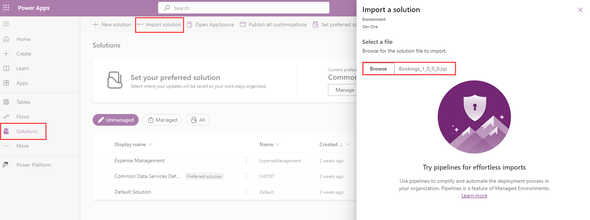
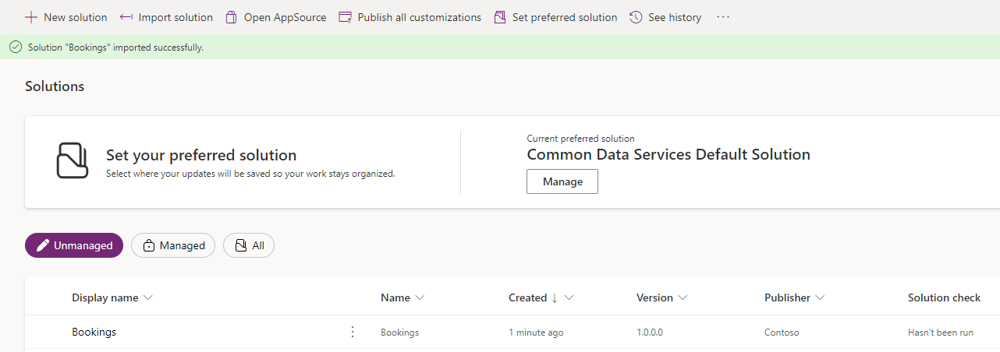
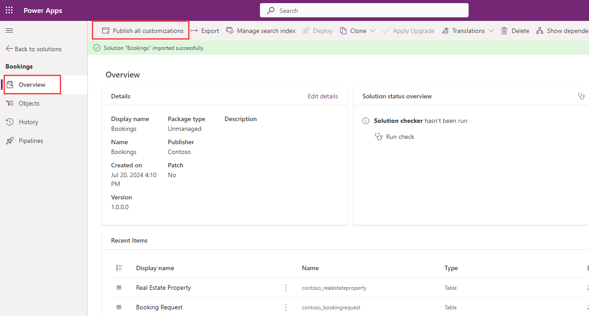
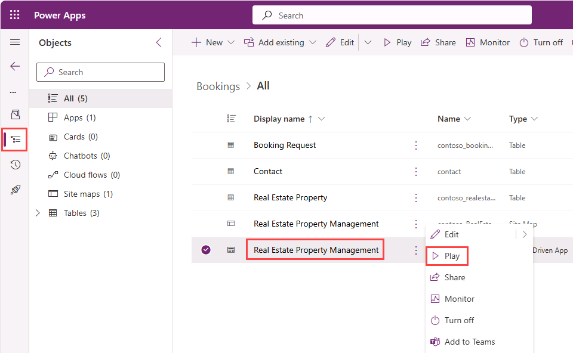
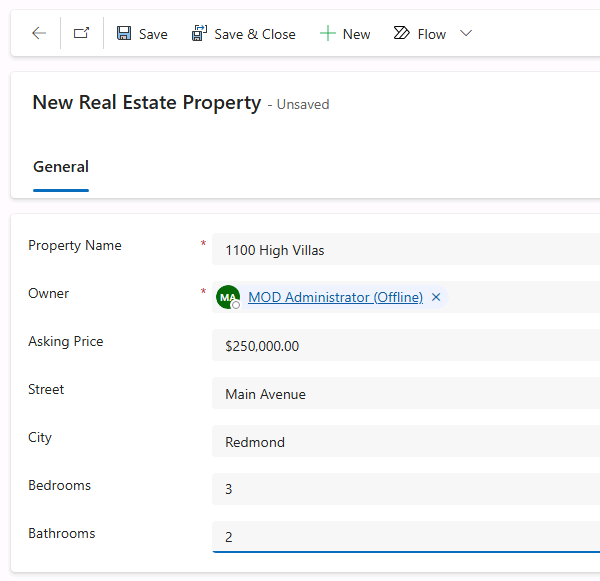
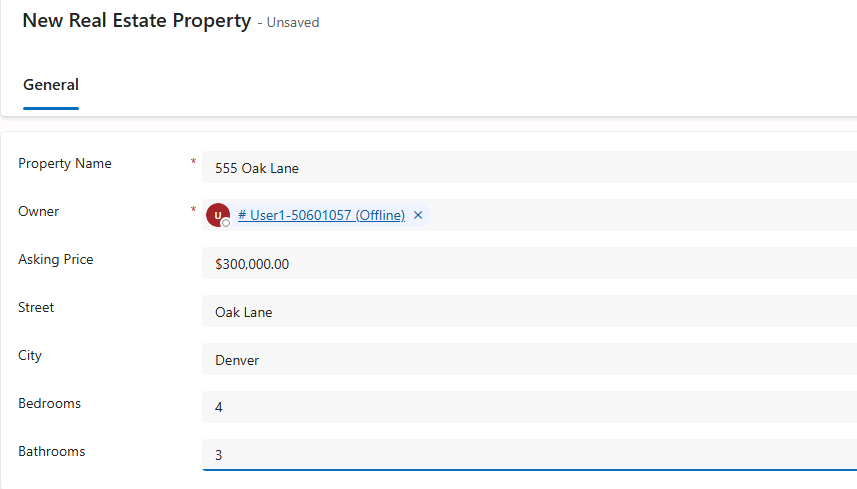

---
lab:
    title: 'Import Dataverse solution'
    module: 'Build an initial agent with Microsoft Copilot Studio'
---

# Import Dataverse solution

In this exercise, you'll import a Dataverse solution to use in the following labs.

This exercise will take approximately **10** minutes to complete.

> **Note**: This exercise assumes you already have a Copilot Studio license or have signed up for a [free trial](https://go.microsoft.com/fwlink/p/?linkid=2252605) and have a Power Platform environment to work in.

## Add User Account as the Environment Owner

1. Sign in to the Power Platform admin center.

    ```
    https://admin.powerplatform.microsoft.com/
    ```
2. In the navigation pane, select **Manage**.

3. In the Manage pane, select **Environments**.

4. Select **+ New**

5. Enter the following information then click **Save**. 

    - Name: **Enter a unique name**

    - Region: **United States**

    - Type: **Developer**

6. If the page does not refresh automatically after a few minutes refresh manually to see if your environment is ready.

<!-- 4. On the Environments page, select the available environment.

5. In the command bar, select **Settings**.

6. Expand **Users + permissions**, then select **Users**. -->

## Exercise 1 – Import solution

In this exercise, you will import a Dataverse solution into your environment that contains the tables needed for the labs.

### Task 1.1 – Download solution

1. In a new broser tab, navigate to the **Bookings_1_0_0_0.zip** file in GitHub at the below URL.

    ```
    https://github.com/MicrosoftLearning/mslearn-copilotstudio/blob/main/Allfiles/Bookings_1_0_0_0.zip
    ```

1. Select the **ellipses (...)** near the top-right and select **Download**.

1. Close the brower tab.

### Task 1.2 – Import solution

1. In a new browser tab, navigate to the below URL.

    ```
    https://make.powerapps.com
    ```

1. If prompted for credentials, sign in with the email address and password located in the lab player's **Environment** tab.

1. If prompted for contact information, set the Country/region and select **Get Started**.

1. In the upper-right of the screen, change to the environment you created. This is where you will be working for the entirety of the labs. If it is not, select the appropriate environment.

1. In the left navigation, select **Solutions**.

1. In the top bar, select **Import solution**.

1. Select **Browse** and locate the **Bookings_1_0_0_0.zip** file from your Downloads folder and select **Open**.

    

1. Select **Next**.

1. Select **Import**.

    The solution will import in the background. This may take a few minutes.

    

    > **Alert:** Wait until the solution has finished importing before continuing to the next step.

1. When the solution has imported successfully, open the **Bookings** solution.

1. In the left navigation, select the **Overview** tab.

    

1. Select **Publish all customizations**.

### Task 1.3 – Test data

1. In the left navigation of the Bookings solution, select the **Objects** tab.

1. Select the **ellipsis …** menu for the **Real Estate Property Management** Model-Driven App, and select **Play**.

    

1. Select **+ New**.

1. Enter the following data:

    - **Property Name:** `1100 High Villas`
    - **Owner:** Select your user
    - **Asking Price:** `250,000`
    - **Street:** `Main Avenue`
    - **City:** `Redmond`
    - **Bedrooms:** `3`
    - **Bathrooms:** `2`

    

1. Select **Save & Close**.

1. Select **+ New**.

1. Enter the following data:

    - **Property Name:** `555 Oak Lane`
    - **Owner:** Select your user
    - **Asking Price:** `300,000`
    - **Street:** `Oak Lane`
    - **City:** `Denver`
    - **Bedrooms:** `4`
    - **Bathrooms:** `3`

    

1. Select **Save & Close**.

You now have 2 Active Real Estate Properties in the view. 
